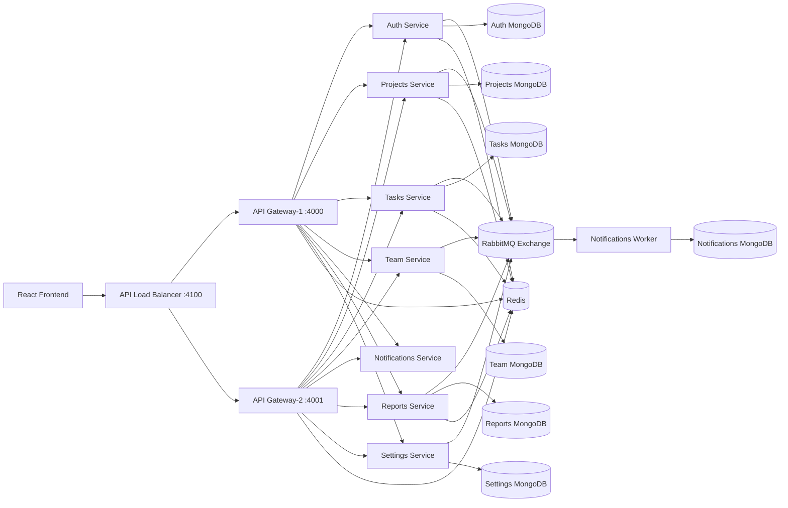

# PAMCA608 - System Design (Winter 2025-26)

## Submission Cover

| Field | Value |
| --- | --- |
| Course | PAMCA608 - System Design |
| Semester | Winter 2025-26 |
| Project Title | Coordify - Microservices Project Management Platform |
| Student Name | __________________________ |
| Student ID | __________________________ |
| Department | __________________________ |
| Faculty/Instructor | __________________________ |
| Date of Submission | __________________________ |

---

## Abstract

Coordify is a full-stack project management and team collaboration platform developed using a MERN-based architecture. The application addresses core collaboration problems such as secure user authentication, role-based authorization, project and task lifecycle tracking, team invitation workflows, configurable notifications, report generation, and user settings management.

The frontend is built with React, while backend capabilities are implemented as independent Node.js/Express microservices connected through an API Gateway and load balancer. MongoDB is used with a database-per-service model to ensure service-level data isolation. Redis provides caching and token/OTP storage support, and RabbitMQ enables asynchronous event-driven processing for notifications and cross-service decoupling.

The system design emphasizes scalability, fault tolerance, and maintainability through:
- Microservices with clear bounded responsibilities
- Synchronous and asynchronous inter-service communication
- Cache-assisted read optimization
- Event-driven processing with DLQ handling
- Containerized deployment and Kubernetes-ready manifests

---

## 1. Introduction

### 1.1 Background of the Problem

Modern teams require collaborative platforms that support simultaneous project execution, task tracking, and secure access control. Monolithic architectures become difficult to scale and maintain when multiple business domains evolve independently.

### 1.2 Need for the System

The required system must support:
- Multi-role users (admin, manager, member, viewer)
- Project and task execution flows
- Team onboarding and invitation acceptance
- Notifications and asynchronous updates
- Security, scalability, and service resilience

### 1.3 Scope of the Application

Coordify covers:
- Authentication with OTP verification and password reset
- Project management and member assignment
- Task management, subtasks, and comments
- Team invitations and role updates
- Reports generation (including AI-assisted summaries)
- Notification center and read/unread workflows
- User settings and preferences

### 1.4 Objectives

1. Build a production-style MERN microservices system.
2. Isolate business capabilities into independent services.
3. Implement both REST-based and event-driven communication.
4. Improve performance using caching and throttling.
5. Ensure secure role-aware API access and controlled scaling.

### 1.5 Overview of MERN Stack

- MongoDB: Persistent storage with service-level isolation
- Express.js: REST API layer per microservice
- React: Client-side web application
- Node.js: Runtime for services and workers

---

## 2. System Requirements Analysis

### 2.1 Functional Requirements

| Module | Key Functional Requirements |
| --- | --- |
| Authentication | Signup, login, JWT issue/refresh, logout, OTP verification, password reset |
| Projects | Create, read, update, delete projects; add/remove members |
| Tasks | Create/update/delete tasks; status updates; subtasks; comments |
| Team | Invite members, accept invitations, update roles, remove member |
| Notifications | Create/read/update/delete notifications; mark read; mark all read |
| Reports | Generate project/team reports; fetch reports by ID |
| Settings | Get and update profile/notification/privacy settings |
| Gateway | Route requests, apply rate limits, cache GET responses |

### 2.2 Non-Functional Requirements

| Category | Requirement |
| --- | --- |
| Scalability | Horizontal scaling via replicas and HPA for selected services |
| Availability | Load balancing with retry and unhealthy upstream cooldown |
| Performance | Redis cache + in-memory fallback; gateway-level rate limiting |
| Security | JWT auth, role guards, internal service token headers |
| Reliability | Durable RabbitMQ exchange/queues and DLQ routing |
| Fault Tolerance | Graceful degradation when Redis/RabbitMQ is unavailable |
| Observability | Prometheus metrics and Grafana dashboards |

### 2.3 Assumptions and Constraints

- Cross-service transactions are eventually consistent (no distributed 2PC).
- MongoDB document updates are last-write-wins unless guarded by business logic.
- Internal service trust is based on shared secret token configuration.
- Deployment assumes containerized environments (Docker/Kubernetes).

---

## 3. System Architecture Design

### 3.1 Overall Architecture

The system follows a client-server microservices architecture:

- React frontend sends requests to an API load balancer.
- Load balancer forwards to one of the API Gateway instances.
- Gateway proxies to target domain microservices.
- Services persist data in service-specific Mongo databases.
- Services publish domain events to RabbitMQ topic exchange.
- Notifications worker consumes events and creates notifications/emails asynchronously.

### 3.2 Architecture Diagram

### 3.3 Technology Stack

| Layer | Technologies |
| --- | --- |
| Frontend | React 18, React Router, Axios, TanStack Query, Zustand, Tailwind CSS, Vite |
| Backend | Node.js, Express, Zod, JWT, bcrypt |
| Databases | MongoDB (service-wise databases) |
| Cache | Redis (+ in-memory fallback caches) |
| Messaging | RabbitMQ topic exchange, service queues, DLQ |
| Infra | Docker Compose, Kubernetes manifests |
| Monitoring | Prometheus, Grafana |

---

## 4. Identification of Microservices and Responsibilities

| Microservice | Core Responsibilities |
| --- | --- |
| api-gateway | Entry point, proxy routing, rate limiting, cache middleware, service health APIs |
| api-load-balancer | Round-robin distribution, retry for idempotent requests, unhealthy cooldown |
| auth-service | User signup/login, OTP verification, token refresh/revocation |
| projects-service | Project CRUD and project member management |
| tasks-service | Task CRUD, status updates, subtasks, comments |
| team-service | Invitations, invitation acceptance, role updates, member lifecycle |
| notifications-service | Notifications API + persistence; worker-based event consumption |
| reports-service | Report generation/listing and AI summary generation |
| settings-service | User settings and notification preference updates |

---

## 5. Inter-Service Communication

### 5.1 REST Communication

- Frontend uses a single gateway URL and API prefix.
- Gateway proxies requests to backend services by route base path.
- Internal headers are passed for user role and identity propagation.

### 5.2 API Gateway

- Implements path rewrite for versioned APIs.
- Applies gateway-level rate limiting.
- Uses Redis-backed response caching for selected GET routes.
- Maintains service registry and route discovery endpoints.

### 5.3 Service-to-Service

- Synchronous calls: Via HTTP proxying through gateway.
- Asynchronous calls: Via RabbitMQ event publishing/consuming.

---

## 6. Concurrency Control and Consistency Handling

### 6.1 Current Concurrency Controls

- Unique indexes on key identifiers (id, email, userId) prevent duplicates.
- Token revocation uses Redis TTL blacklisting to avoid stale token use.
- Request throttling at gateway reduces burst contention.

### 6.2 Consistency Strategy

- Intra-service writes are strongly consistent per request.
- Cross-service outcomes (especially notifications) are eventually consistent.
- Cache invalidation is triggered after create/update/delete in cache-enabled services.

### 6.3 Failure Handling

- RabbitMQ consumer failures move messages to DLQ.
- Redis/RabbitMQ unavailability can trigger fallback behavior in selected paths.

---

## 7. Caching Mechanism

### 7.1 Gateway Cache

- GET requests for configured prefixes are cached in Redis.
- Cache key includes method, user id, role, and URL for scoped correctness.
- Responses include x-cache: HIT/MISS for observability.

### 7.2 Service-Level Cache

- Projects, Tasks, Reports services cache list/read responses.
- Redis is primary cache, in-memory map is fallback.
- TTL-based expiration (for example 120 seconds in deployment config).

### 7.3 Auth Cache/Store Usage

- OTPs are stored in Redis with strict TTL.
- Refresh tokens and revoked access tokens are stored with expiration logic.

---

## 8. Event-Driven Messaging and Asynchronous Processing

### 8.1 Event Flow

1. Producer services publish domain events to RabbitMQ exchange.
2. Service-specific queues receive events via routing keys.
3. Notification worker consumes messages and persists notifications.
4. Worker sends email for selected event types.

### 8.2 Reliability Controls

- Durable topic exchange and durable queues
- Prefetch-based consumer tuning
- Ack on success, nack without requeue on failure
- Dead-letter exchange and dead-letter queue routing

### 8.3 Business Value

- Improves user-facing API responsiveness
- Decouples notification/email side effects from main transaction path
- Enables worker horizontal scaling independent of API services

---

## 9. Database Design

### 9.1 Database per Service

| Service DB | Primary Collections |
| --- | --- |
| coordify_auth_service | users |
| coordify_projects_service | projects |
| coordify_tasks_service | tasks |
| coordify_team_service | members |
| coordify_notifications_service | notifications |
| coordify_reports_service | reports |
| coordify_settings_service | settings |
| coordify_api_gateway_service | service registry metadata |

### 9.2 Design Notes

- Isolation reduces coupling and supports independent schema evolution.
- Service-specific indexes improve query reliability and uniqueness constraints.
- Embedded subtasks/comments in task documents simplify task-level retrieval.

---

## 10. API Design

### 10.1 Versioning

- All APIs are exposed under `/api/v1` through gateway.

### 10.2 Major API Groups

| Service | Sample Endpoints |
| --- | --- |
| Auth | `/auth/signup`, `/auth/login`, `/auth/refresh`, `/auth/verify-email` |
| Projects | `/projects`, `/projects/:projectId`, `/projects/:projectId/members` |
| Tasks | `/tasks`, `/tasks/:taskId/status`, `/tasks/:taskId/subtasks`, `/tasks/:taskId/comments` |
| Team | `/team/invite`, `/team/invitations/accept`, `/team/:memberId/role` |
| Notifications | `/notifications`, `/notifications/:notificationId/read`, `/notifications/read-all` |
| Reports | `/reports`, `/reports/project`, `/reports/team`, `/reports/:reportId` |
| Settings | `/settings/:userId`, `/settings/:userId/notifications` |

---

## 11. Implementation Details

### 11.1 Frontend

- React app with lazy-loaded route modules and protected route wrapper.
- Global providers: Auth context, Theme context, Query client provider.
- Axios interceptors for bearer token injection and refresh-token flow.
- Role-based permission mapping for UI-level access control.

### 11.2 Backend

- Express app per service with domain-specific route modules.
- Zod schemas for request validation.
- Role guards for restricted endpoints.
- Gateway applies rate limiting and proxy-level caching.

### 11.3 Database

- MongoDB collections with unique indexes.
- Redis for OTP/token/cache with TTL.
- Notification worker writes event outcomes asynchronously.

---

## 12. Deployment and Execution

### 12.1 Docker Deployment (Local)

1. Start infrastructure and all services using Docker Compose.
2. Access frontend at port 5173 and API via load balancer at 4100.

### 12.2 Kubernetes Deployment

The project includes Kubernetes manifests with:
- Namespace and secret definitions
- Deployments + Services for infra and all microservices
- Resource requests/limits for selected services
- Readiness/liveness probes for health checks
- HorizontalPodAutoscaler for API Gateway, load balancer, tasks, notifications, reports

### 12.3 Runtime Scalability Features

- Multiple replicas for core services
- HPA CPU-based autoscaling policies
- External LoadBalancer service for API ingress

---

## 13. Conclusion

Coordify demonstrates a practical microservices implementation aligned with PAMCA608 system design objectives. The platform integrates MERN application development with production-style architecture concerns, including API gateway routing, load balancing, role-aware authorization, distributed caching, asynchronous event processing, and autoscaling-ready deployment.

The design offers a strong foundation for enterprise-grade evolution, with clear service boundaries and operational controls that support reliability, performance, and maintainability.

---

## Annexure A: Quick Validation Checklist

- [ ] All endpoints are reachable through `/api/v1` gateway prefix
- [ ] Redis and RabbitMQ connectivity verified
- [ ] Task/project/report cache HIT/MISS behavior validated
- [ ] Event producer -> worker -> notification persistence flow validated
- [ ] Role restrictions tested for admin/manager/member/viewer
- [ ] HPA and probes validated in Kubernetes cluster

## Annexure B: Viva/Presentation Talking Points

1. Why microservices over monolith in this project context
2. How cache keys are scoped to role and user identity
3. Why asynchronous notifications improve response time
4. How DLQ protects against poison messages
5. How HPA + probes improve service resilience
